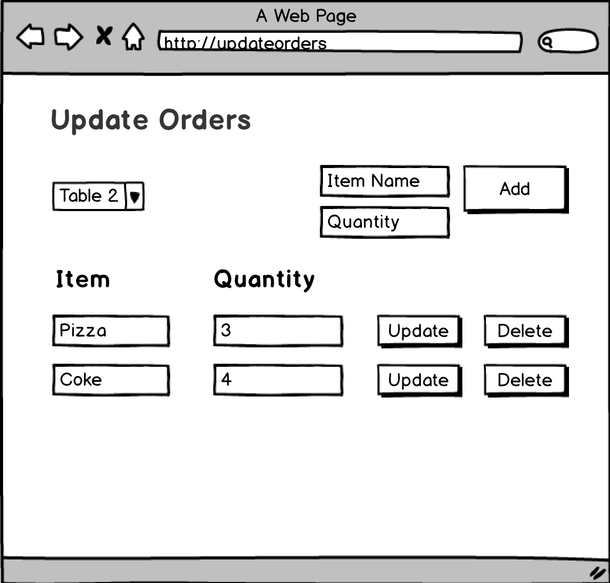

# JavaScript Modular Client

# Part 1: Refactoring

Understand the module pattern for JavaScript and make a refactoring of your code to have two layer modules (FrontEnd and Network):

- Network Layer -> Implement the method *getOrders* of the *RestaurantRestController.js* using the [axios library](https://github.com/axios/axios) to make the HTTP calls to the REST API.
 
    
- FrontEnd Layer -> Implement the method *showOrdersByTable* of the *OrdersController.js*
    
  
Reference: https://toddmotto.com/mastering-the-module-pattern/

# Part 2: FrontEnd implementation - Orders

Modify the *index.html* page so it displays the following orders structure:

- Add the *OrdersController.js* and *RestaurantRestController.js* to the *index.html*
- Connect the modules with your HTML code:
    - Call the *getOrders* method of the RestaurantRestController module (You can add a log so you can verify that it actually retrieves the data from the server)
    - Connect the two modules by calling the  *OrdersController.js* -> *showOrdersByTable* method from the *RestaurantRestController.js* once the request promise is completed.
- Call the *showOrdersByTable* function on the [onload](https://www.w3schools.com/tags/ev_onload.asp) event so the orders load once tha page is loaded.

# Part 2: Orders CRUD: FrontEnd

Create a new html page that has the following structure:

Implement the CRUD methods of the *RestaurantRestController.js* using the [axios library](https://github.com/axios/axios) to make the HTTP calls to the REST API.

    - updateOrder
    - deleteOrder
    
    
Implement the remaining methods of the *OrdersController.js*

    - addItemToOrder
    - updateOrder
    - deleteOrderItem
    
- Call the *getOrders* function on the [onload](https://www.w3schools.com/tags/ev_onload.asp) and store it on global variable    
    
Connect your html components with your controllers:

   - Implement a listener for the comboBox so when you change the order then the Update Orders table changes with the corresponding items (user the orders global variable).
   - Call the function *addItemToOrder* when the Add button is clicked (make sure you validate the submitted data)
   - Call the function *updateOrder* when the Update button is clicked (make sure you validate the submitted data)
   - Call the function *deleteOrderItem* when the Delete button is clicked
   
# Part 3: Orders CRUD: BackEnd   

Implement the missing methods on your REST API in order to be able to serve your JavaScript client:

- updateOrder
- addItemToOrder
- deleteOrderItem
 